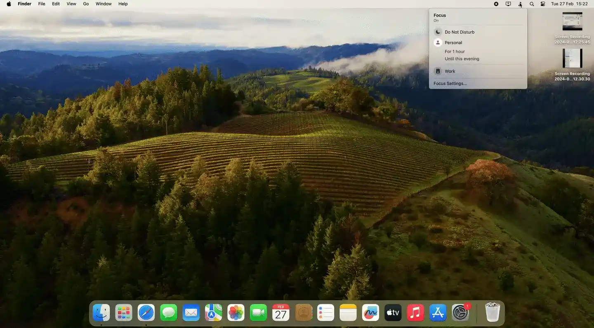
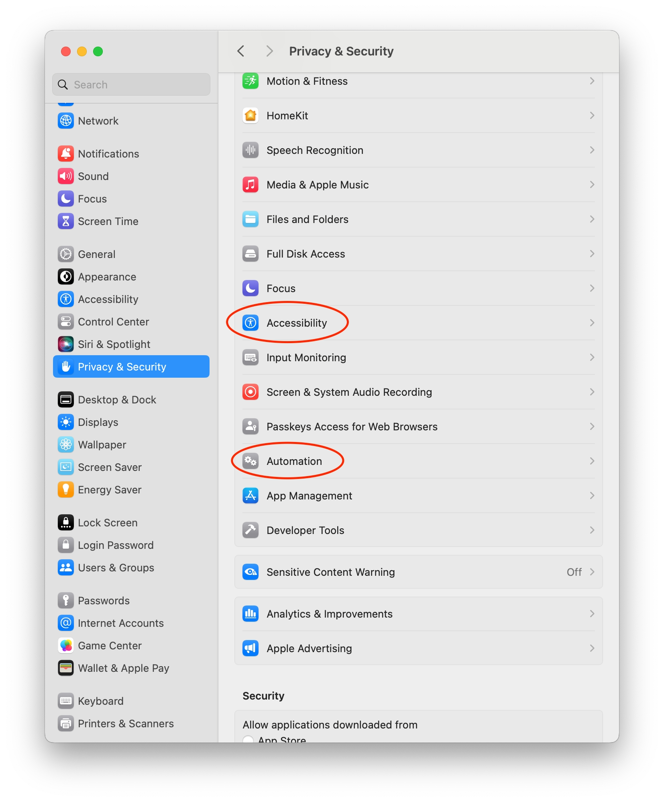

  
  <h1>
    Outer Spaces
  </h1>
  

   A macOS menu bar app to change your current space according to your focus change.
  

  

    <a href="#features">Features</a> •
    <a href="#installation">Installation</a> •
    <a href="#permission-request">Permission Request</a> •
    <a href="#contributing">Contributing</a> •
    <a href="#languages">Languages</a> •
    <a href="#acknowledgement">Acknowledgement</a>
  

Outer Spaces is a macOS application for switching your spaces according to your selected focus!

## Features

* Create presets for your focus
* Change your spaces automatically
* Toggle Stage Manager per preset settings 

 

## Installation

Download the latest release from [this Github repository Releases page](https://github.com/Lospi/Outer-Spaces/releases).
Just drag the .app to the Application folder using the .dmg file.

## Permission Request

Outer Spaces requires two permissions: Accessibility and Automation. Make sure to enable both permissions within Privacy and Security on your macOS settings.

 

## Contributing

Feel free to share, open issues and contribute to this project! ❤️

## Languages

🇺🇸 English • 🇧🇷 Brazilian Portuguese

1.  Add a new Localization with Outer Spaces project Info settings
2.  Edit the **Localizable**  file with the proper translations

## Acknowledgement

This README file was heavily inspired by [Reminders MenuBar repository](https://github.com/DamascenoRafael/reminders-menubar) description.
