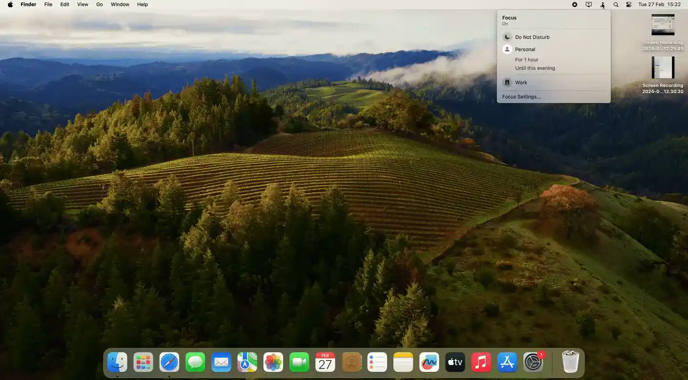
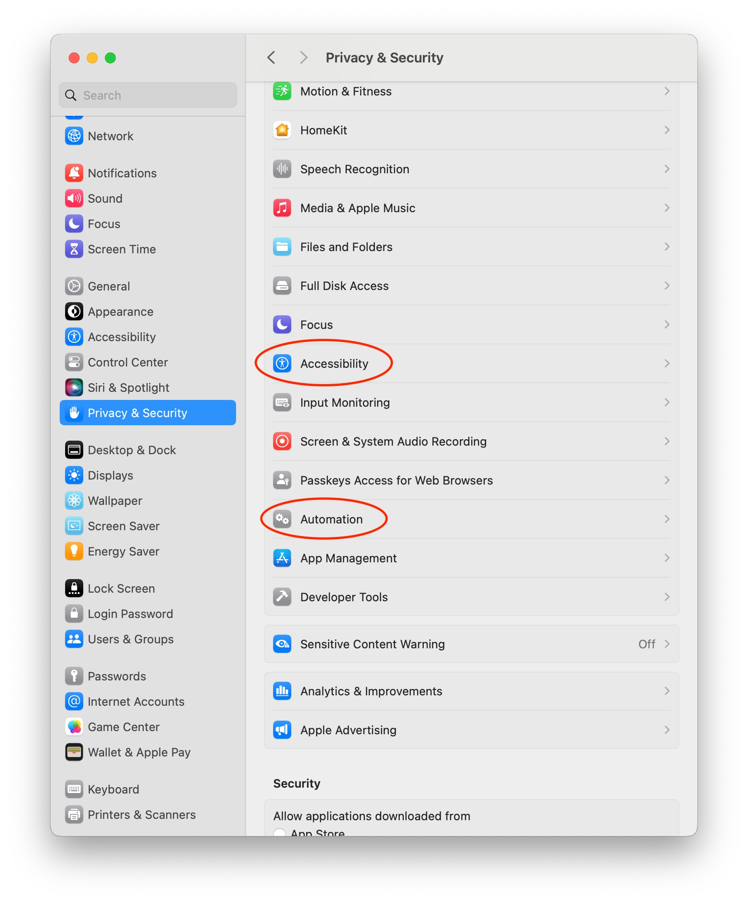

  
  <h1>
    Outer Spaces
  </h1>
  

   A macOS menu bar app to change your current space according to your focus change.
  

  

    <a href="#features">Features</a> •
    <a href="#installation">Installation</a> •
    <a href="#permission-request">Permission Request</a> •
    <a href="#contributing">Contributing</a> •
    <a href="#languages">Languages</a> •
    <a href="#acknowledgement">Acknowledgement</a>
  

Outer Spaces is a macOS application for switching your spaces according to your selected focus!

## Features

* Create presets for your focus
* Change your spaces automatically
* Toggle Stage Manager per preset settings
* Set a default preset when leaving focus

 

## Installation

Download the latest release from [this Github repository Releases page](https://github.com/Lospi/Outer-Spaces/releases).
Just drag the .app to the Application folder using the .dmg file.

## Permission Request

Outer Spaces requires two permissions: Accessibility and Automation. Make sure to enable both permissions within Privacy and Security on your macOS settings.

 

## Contributing

Feel free to share, open issues and contribute to this project! ❤️

## Languages

🇺🇸 English • 🇧🇷 Brazilian Portuguese

1.  Add a new Localization with Outer Spaces project Info settings
2.  Edit the **Localizable**  file with the proper translations

## Acknowledgement

This README file was heavily inspired by [Reminders MenuBar repository](https://github.com/DamascenoRafael/reminders-menubar) description.

## Building and validating Focus switching

Use a stable build location outside temporary directories, and keep the signing identity consistent with the app whose privacy permissions you granted. During acceptance, TCC logged a stored Developer ID requirement rejecting an Apple Development-signed build with the same bundle ID. An off/on toggle retained that old requirement. The same source signed with the project's Developer ID identity was recognized as authorized. This reproduces a local signing mismatch, not necessarily the historical cause of issue #8.

If using development signing, explicitly grant that exact development app after removing its stale entry through System Settings. If testing against the existing distributed app's grant, use the project's matching Developer ID identity. Do not broadly reset privacy databases. Register and launch the exact stable app copy before granting permissions; TCC cannot attach a valid requirement when Launch Services cannot resolve the bundle.

For a separate development permission setup, use the `Outer Spaces` scheme with a stable **Apple Development** signing identity
and your own development team. Keep the same bundle identifier and build location
between runs. A build with code signing disabled checks compilation only; it does
not validate macOS privacy permissions or Focus-filter registration.

1. Quit other copies of Outer Spaces before running the source build.
2. Launch the exact `.app` built by Xcode. In Privacy & Security, grant that app
   Accessibility and allow it to control **System Events** under Automation.
   If a rebuilt or differently signed copy is denied, remove the stale app entry
   and add the current build again. Do not reset all privacy permissions or disable SIP.
3. Enable the Mission Control shortcuts for the desktops in the preset. The app
   uses Control+1…9 for Desktop 1…9, Control+Option+0 for Desktop 10, and
   Control+Option+1…9 for Desktop 11…19. Configure these exact combinations for
   desktops beyond 9; remapped or disabled shortcuts cannot be inferred automatically.
4. Refresh Spaces, create a preset, and select it in System Settings → Focus →
   Focus Filters → Outer Spaces. If the app identity changed, reselect its filter.
5. Check a manual desktop switch, then toggle the configured Focus. Test permission
   denial and recovery separately for Accessibility and Automation. An accepted
   keyboard event now counts as success only after the target desktop is observed.
6. Check Focus deactivation with a saved default preset, then deny Focus Status
   access: unknown status must not repeatedly apply the default preset. An active
   mapped filter takes precedence over the shared notification-availability status.

PR verification uses the `Outer Spaces Tests` Swift Testing target. Its injected
switching and Focus dependencies do not send keystrokes or change real Focus modes.
Signed runtime checks are still required for permission recovery, shortcut mappings,
fullscreen desktops, and multiple displays. Issue #8's original signing/TCC cause
must not be considered reproduced solely because an unsigned build or unit test passes.

### Automatic return to Focus Spaces

Edit a preset in the menu and enable **Automatically return to Focus Spaces**. Choose a whole-minute delay from 1–60 (default: five). Existing presets stay disabled until opted in. Assign the preset to a macOS Focus filter to activate automatic return; selecting it in the editor alone does not activate it.

Leaving any configured display starts one deadline, visible beside the menu-bar icon and in the menu. Further departures do not extend it. Returning all displays manually cancels it. **Return Now** switches only displays still away. **Pause for This Focus** survives duplicate filter callbacks and preset edits; **Resume** starts a full new delay if still away. A different mapped preset or filter deactivation clears the pause. Two Focus modes using the same preset are indistinguishable through the available filter configuration.

Missing targets/displays suspend return. Deleting or disabling the preset cancels it. Target/delay edits start a fresh deadline when eligible. Sleep cancels pending work; wake and launch reload the filter and Spaces before starting a fresh delay. Countdown and temporary pause are never persisted. A failed return surfaces an error and pauses retries until Resume.

For signed acceptance, use a valid disposable preset with a one-minute delay. Verify departures, additional switches without extending the deadline, manual return cancellation, Return Now, pause/resume, target edits/deletion, filter changes, sleep/wake, and actual return after expiry. Repeat with fullscreen and multiple displays. Confirm a denied permission or disabled shortcut produces an error and no retry loop. Restore any test configuration afterward. Automated virtual-time tests validate controller behavior; they do not establish macOS permission or shortcut acceptance.
